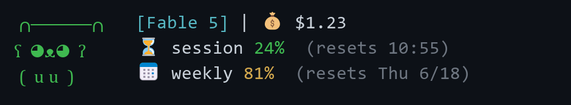
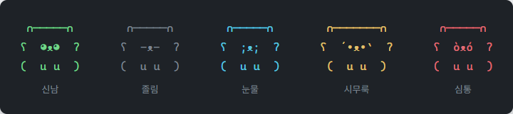
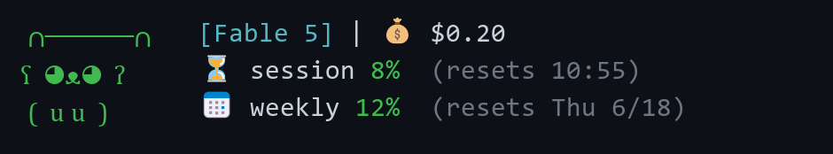

# 🐻 claude-code-bear-statusline

A bear-themed status line for [Claude Code](https://code.claude.com) — a tamagotchi-style bear whose **mood changes randomly every minute** (3-line layout with ears and paws!), shown next to your model name, session cost, 5-hour session limit (with reset time) and weekly limit (with reset date).

> 🇰🇷 한국어 설명은 [아래](#-한국어)에 있습니다.



```
 ∩─────∩     [Fable 5] | 💰 $1.23
ʕ  ≧ᴥ≦  ʔ    ⏳ session 24% (resets 10:55)
 (  u u  )   📅 weekly 81% (resets Thu 6/18)
```

Single file, **zero dependencies**, one-line install. Auto-detects your language (English / 한국어).

## What it shows

| Item | Meaning |
|---|---|
| `ʕ  ≧ᴥ≦  ʔ` | The bear's mood — the face changes at random every minute (see table below) |
| `[model]` | Model in use for the current session |
| 💰 `$1.23` | Cumulative cost of the current session (API-equivalent, USD) |
| ⏳ `session 24% (resets 10:55)` | 5-hour session limit usage and reset time |
| 📅 `weekly 81% (resets Thu 6/18)` | Weekly (7-day) limit usage and reset date |

Usage colors: **green < 70% · yellow 70–89% · red ≥ 90%**.

## The bear's mood



Like a tamagotchi, the mood changes **at random every minute**. It is independent of your usage — pure mood, expressed by the face and color only, no words. (To avoid flicker, the same minute keeps the same mood by seeding on a time bucket + session ID, so moods also differ per session.)

| Face | Mood | Color |
|---|---|---|
| ʕ  ◕ᴥ◕  ʔ | excited | green |
| ʕ  ≧ᴥ≦  ʔ | happy | green |
| ʕ  -ᴥ◕  ʔ | wink | magenta |
| ʕ  •ᴥ•  ʔ | calm | default |
| ʕ  -ᴥ-  ʔ | sleepy | dim |
| ʕ  ◉ᴥ◉  ʔ | surprised | yellow |
| ʕ  @ᴥ@  ʔ | dizzy | yellow |
| ʕ  ´•ᴥ•\`  ʔ | gloomy | yellow |
| ʕ  ;ᴥ;  ʔ | teary | cyan |
| ʕ  òᴥó  ʔ | grumpy | red |

The ears (`∩─────∩`) stretch to match the face width. The usage colors (green/yellow/red) stay on the numbers.

> Rate-limit info (`rate_limits`) is delivered to Claude Pro/Max subscribers only after the session's first API response.
> Right after a new session starts, showing just `🐻 [model] | 💰 $0.00` is normal.

## Install

Requires [Node.js](https://nodejs.org) (no packages — just one script file).

### One-line install

Downloads the script to `~/.claude/` and adds only the `statusLine` entry to your `settings.json` (existing settings are preserved).

**Windows (PowerShell):**
```powershell
irm https://raw.githubusercontent.com/Haneul-two/claude-code-bear-statusline/main/install.ps1 | iex
```

**macOS / Linux:**
```bash
curl -fsSL https://raw.githubusercontent.com/Haneul-two/claude-code-bear-statusline/main/install.sh | bash
```

Restart Claude Code and the bear appears.

### Manual install

1. Save `statusline-bear.js` somewhere, e.g. `~/.claude/statusline-bear.js`.

2. Add a statusLine entry to `~/.claude/settings.json`.

   **Windows:**
   ```json
   {
     "statusLine": {
       "type": "command",
       "command": "node \"C:\\Users\\<username>\\.claude\\statusline-bear.js\""
     }
   }
   ```

   **macOS / Linux:**
   ```json
   {
     "statusLine": {
       "type": "command",
       "command": "node ~/.claude/statusline-bear.js"
     }
   }
   ```

3. Restart Claude Code.

## Language

Labels are shown in **English by default** and in **Korean** when your locale is Korean (`LANG` containing `ko`). Force a language with the `BEAR_LANG` environment variable (`en` or `ko`):

```json
{
  "statusLine": {
    "type": "command",
    "command": "BEAR_LANG=ko node ~/.claude/statusline-bear.js"
  }
}
```

On Windows, set it in your environment or wrap with `cmd /c "set BEAR_LANG=ko && node ..."`.

## Mood mode

By default the mood is **purely random** (`BEAR_MOOD=random`). Set `BEAR_MOOD=react` to make the bear **react to your usage** instead — the higher your session/weekly limit usage, the more worried the bear gets:




| Usage (max of session / weekly) | Mood |
|---|---|
| 0–40% | excited / happy / wink |
| 40–70% | calm / sleepy |
| 70–90% | gloomy / surprised / dizzy |
| 90%+ | teary / grumpy |

```json
{ "statusLine": { "type": "command", "command": "BEAR_MOOD=react node ~/.claude/statusline-bear.js" } }
```

While rate-limit info isn't available yet (e.g. right after a new session), `react` falls back to random.

## How it works

Claude Code passes session info as JSON on stdin to the status-line command. Fields this script uses:

- `model.display_name` — model name
- `cost.total_cost_usd` — cumulative session cost
- `rate_limits.five_hour.used_percentage` / `.resets_at` — 5-hour usage and reset (Unix epoch)
- `rate_limits.seven_day.used_percentage` / `.resets_at` — weekly usage and reset (Unix epoch)
- `session_id` — mood random seed (different mood per session)

See the [official status line docs](https://code.claude.com/docs/en/statusline) for the full schema.

## Customizing

- **Add/change moods**: add or edit `{ eyes, color }` in the `MOODS` array
- **Mood interval**: adjust `MOOD_INTERVAL_MS` (default 1 minute)
- **Bear column width**: tweak `COL` if the info columns sit too close or too far
- **Add a language**: extend the `I18N` table
- **Mood mode**: set `BEAR_MOOD=react` to tie the mood to usage (default `random`); tune the band thresholds inline
- **Color thresholds**: change the `90` / `70` values in `pctColor`

## License

MIT

---

## 🇰🇷 한국어

Claude Code용 곰 상태표시줄. **다마고치처럼 1분마다 기분이 랜덤으로 바뀌는 곰(3줄)** 옆에 모델명, 세션 비용, 5시간 세션 한도(초기화 **시각**), 주간 한도(초기화 **날짜**)를 보여줍니다. 의존성 없음, 단일 파일, 한 줄 설치. 언어는 자동 감지(영어 / 한국어)됩니다.

```
 ∩─────∩     [Fable 5] | 💰 $1.23
ʕ  ≧ᴥ≦  ʔ    ⏳ 세션 24% (10:55 초기화)
 (  u u  )   📅 주간 81% (6/18(목) 초기화)
```

### 표시 항목

| 항목 | 의미 |
|---|---|
| `ʕ  ≧ᴥ≦  ʔ` | 곰의 기분 — 1분마다 표정이 랜덤으로 바뀝니다 |
| `[모델명]` | 현재 세션에서 사용 중인 모델 |
| 💰 `$1.23` | 현재 세션의 누적 비용 (API 요금 환산치, USD) |
| ⏳ `세션 24% (10:55 초기화)` | 5시간 세션 한도 사용률과 초기화 시각 |
| 📅 `주간 81% (6/18(목) 초기화)` | 주간(7일) 한도 사용률과 초기화 날짜 |

사용률 색상: **70% 미만 초록 · 70~89% 노랑 · 90% 이상 빨강**

### 곰의 기분

다마고치처럼 **1분마다 기분이 랜덤으로** 바뀝니다. 한도 사용률과는 무관한 순수한 기분이며, 기분 단어 없이 표정과 색상으로만 표현됩니다. (깜빡임 방지를 위해 시간 버킷 + 세션 ID를 시드로 써서 같은 1분 안에서는 같은 기분을 유지하고, 세션마다 기분도 다릅니다.) 표정 종류는 위 영어 표(`The bear's mood`)와 동일합니다.

> 한도 정보(`rate_limits`)는 Claude Pro/Max 구독자에게 세션의 첫 API 응답 이후부터 전달됩니다.
> 새 세션 시작 직후에는 `🐻 [모델] | 💰 $0.00`만 표시되는 것이 정상입니다.

### 설치

요구사항: [Node.js](https://nodejs.org) (의존성 패키지 없음, 스크립트 파일 하나면 됩니다). 설치 명령은 위 [Install](#install) 섹션과 동일합니다.

### 언어 설정

라벨은 **기본 영어**, 로케일이 한국어(`LANG`에 `ko` 포함)면 **한국어**로 표시됩니다. `BEAR_LANG` 환경변수(`en` 또는 `ko`)로 강제할 수 있습니다. Windows에서는 환경변수로 지정하거나 `cmd /c "set BEAR_LANG=ko && node ..."`로 감쌉니다.

### 기분 모드

기본은 **순수 랜덤**(`BEAR_MOOD=random`)입니다. `BEAR_MOOD=react`로 설정하면 곰이 **사용량에 반응**합니다 — 세션/주간 사용률이 높아질수록 곰이 시무룩→울상이 됩니다 (0~40% 신남, 40~70% 평온, 70~90% 시무룩, 90%+ 눈물/심통). 한도 정보가 아직 없으면 랜덤으로 폴백합니다. `BEAR_MOOD`를 설정하지 않으면 기존 랜덤 동작 그대로입니다.

### 커스터마이징

- **기분 추가/변경**: `MOODS` 배열에 `{ eyes, color }`를 추가/수정
- **기분 전환 주기**: `MOOD_INTERVAL_MS` 값 조정 (기본 1분)
- **기분 모드**: `BEAR_MOOD=react`로 사용량 연동(기본 `random`), 밴드 임계값은 코드에서 조정
- **곰 열 폭**: `COL` 값 조정
- **언어 추가**: `I18N` 표 확장
- **색상 임계값**: `pctColor` 함수의 `90` / `70` 값 조정

### License

MIT
